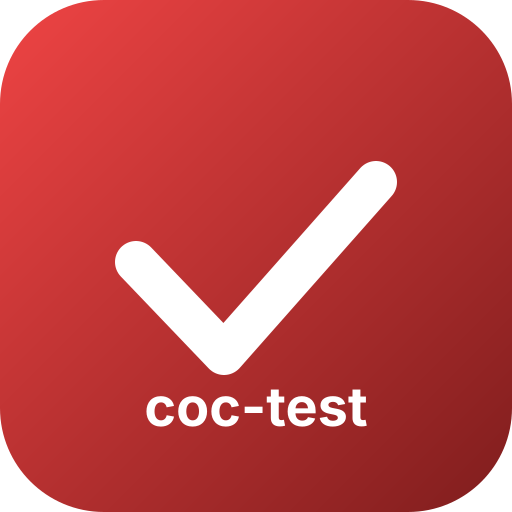

<p align="center">
  
</p>

# coc-test

[](https://github.com/neoclide/coc-test/actions/workflows/ci.yml)

`coc-test` is an integration test runner for coc.nvim extensions. It bundles
JavaScript and TypeScript tests, starts Vim or Neovim with coc.nvim and the
current extension activated, and runs the tests with Node.js's built-in test
runner.

Each test file runs in an isolated child process with its own editor, coc.nvim
instance, and data directory. The runner reports per-file progress in real
time, cleans up all child resources when a test finishes, and prints failure
details with source-mapped stack traces.

## Requirements

- Node.js 22.14 or newer
- Vim or Neovim
- A coc.nvim extension with a valid `main` entry in `package.json`

## Installation

Install `coc-test` as a development dependency in the extension root:

```sh
npm install --save-dev coc-test
```

## Quick start

Run the interactive initializer:

```sh
npx coc-test --init
```

The initializer:

- checks whether `vim` and `nvim` are available;
- optionally adds the `coc-test` configuration to `package.json`;
- creates a starter test in `test/` using a filename you choose;
- optionally adds a `test` script when one does not already exist; and
- optionally creates a GitHub Actions workflow, with a filename you choose,
  for both Vim and Neovim.

Existing test files, scripts, and workflows are not overwritten without
confirmation.

Run all TypeScript tests under `test/`:

```sh
npx coc-test 'test/**/*.test.ts'
```

Neovim is used by default. Select Vim explicitly with `--vim`:

```sh
npx coc-test --vim 'test/**/*.test.ts'
```

## Writing tests

Tests use the APIs from `node:test`. Imports from `coc.nvim` refer to the
coc.nvim instance attached to that test's editor. Importing the extension's
`main` entry returns the exports of the activated extension.

```ts
import assert from 'node:assert/strict'
import { beforeEach, describe, it } from 'node:test'
import { commands, workspace } from 'coc.nvim'
import extension from '../lib/index.js'

beforeEach(async () => {
  await workspace.nvim.command('enew!')
})

describe('extension', () => {
  it('loads the activated extension', () => {
    assert.ok(extension)
    assert.equal(typeof commands.executeCommand, 'function')
  })

  it('communicates with the editor', async () => {
    assert.equal(await workspace.nvim.eval('1 + 1'), 2)
  })
})
```

The extension import path must resolve to the same file as the package's
`main` field.

## Configuration

Use `coc-test.user-settings` in the extension's `package.json` to provide
coc.nvim settings for the test environment:

```json
{
  "coc-test": {
    "user-settings": {
      "suggest.noselect": true
    }
  }
}
```

These settings are written to the isolated coc.nvim configuration before the
tests start.

## Watch mode

Pass `-w` or `--watch` to keep the runner active:

```sh
npx coc-test --watch 'test/**/*.test.ts'
```

When a test file or one of its imported dependencies changes, only the
affected test file is rerun. When the extension entry or one of its local
dependencies changes, all tests are rerun.

If a change occurs while tests are running, the affected run is cancelled
first. Its Node.js child process, editor, and coc.nvim environment are fully
released before the replacement run starts.

## Downloading coc.nvim

By default, `coc-test` downloads the latest coc.nvim release and caches it by
version, so repeated runs reuse the extracted checkout. 

## Using a local coc.nvim build

During coc.nvim or runner development, use an existing build to avoid
downloading:

```sh
npx coc-test --coc-path /path/to/coc.nvim 'test/**/*.test.ts'
```

You can also set `COC_TEST_COC_PATH`:

```sh
COC_TEST_COC_PATH=/path/to/coc.nvim npm test
```

## Useful options

```text
--nvim                         Run tests on Neovim (default)
--vim                          Run tests on Vim
-w, --watch                    Watch files and rerun affected tests
--test-name-pattern <pattern>  Run tests matching a regular expression (must be valid)
--coc-path <directory>         Use an existing coc.nvim build
-u, --use <version>            Use a specific coc.nvim release tag
-d, --download                 Force a fresh coc.nvim download
--force-exit                   Force the main process to exit after the run
```

Long options also accept `--option=value`, for example
`--test-name-pattern=^foo$` or `--coc-path=/path/to/coc.nvim`.

Run `npx coc-test --help` for the complete command reference.

## Environment variables

- `VIM_COMMAND` overrides the `vim` executable.
- `NVIM_COMMAND` overrides the `nvim` executable.
- `COC_TEST_COC_PATH` provides a local coc.nvim directory instead of
  `--coc-path`.
- `NO_COLOR` disables ANSI colors during `--init`.
- `FORCE_COLOR` forces ANSI colors during `--init`.

## Developing coc-test

The unit tests do not download coc.nvim:

```sh
npm test
```

Run the integration fixture against an existing coc.nvim checkout or build:

```sh
npm run test:nvim -- --coc-path /path/to/coc.nvim
npm run test:vim -- --coc-path /path/to/coc.nvim

# Alternatively, provide the path through the environment.
COC_TEST_COC_PATH=/path/to/coc.nvim npm run test:nvim
```

##  LICENSE

MIT
